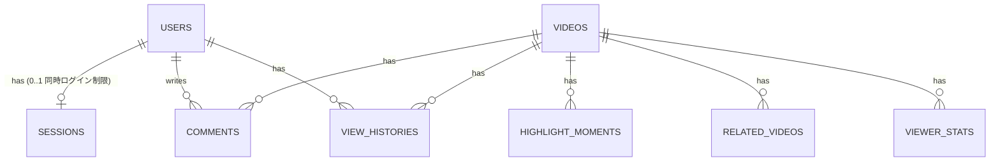

# NijiArchive データモデル設計

**作成日:** 2026-07-06
**ステータス:** Draft
**元資料:** roadmap Part 2 §2。本書はマイグレーションが書ける粒度への落とし込み（Step -1 の成果物）。

---

## 1. ER図



roadmap Part 2 のER図から1点変更：USERS—SESSIONS を `1..0..1` にした。「同時ログイン1セッション制限」（FR-2-2）をアプリロジックではなく **`user_id` のユニーク制約でDB層でも保証する** ため。<!-- 要確認: 将来「同時2台まで」等に緩和するならユニーク制約を外して行数カウントに変える -->

## 2. テーブル定義

全テーブル共通：PKは `uuid`（`gen_random_uuid()`、pgcrypto）。`created_at` / `updated_at` はRails標準で全テーブルに持つ（下表では省略）。

### users

| カラム | 型 | 制約 | 備考 |
|--------|----|------|------|
| email | string | null: false, unique index | citext は使わず Rails 側で downcase 正規化 <!-- 要確認 --> |
| password_digest | string | null: false | bcrypt（has_secure_password） |
| admin | boolean | null: false, default: false | 管理画面アクセス権。ロールテーブルは作らない（管理者は自分1人のため） |

### sessions

同時ログイン制限の心臓部。**CP寄り（強整合性）**。→ ADR-0003

| カラム | 型 | 制約 | 備考 |
|--------|----|------|------|
| user_id | uuid | null: false, FK, **unique index** | ユニーク制約が「1アカウント1セッション」の実体 |
| connection_id | string | null: false | Action Cable のコネクション識別子。切断検知時の削除キー |
| connected_at | datetime | null: false | |
| last_heartbeat_at | datetime | null: false, index | 掃除バッチが `last_heartbeat_at < ?` で走査する |

- 掃除バッチ（Solid Queue定期ジョブ）：ハートビート途絶（タイムアウト値は実測で調整、初期値60秒 <!-- 要確認 -->）のレコードを削除
- Rails 8 Authentication Generator が生成する認証セッションとは別物。こちらは「視聴コネクション」の管理

### videos

| カラム | 型 | 制約 | 備考 |
|--------|----|------|------|
| title | string | null: false | |
| description | text | | |
| status | string | null: false, default: "uploaded", index | enum: `uploaded / processing / ready / failed / published` |
| duration_seconds | integer | | FFprobeで変換時に取得 |
| hls_master_path | string | | R2上のマスタープレイリストのキー。ready以降でnot null |
| published_at | datetime | index | `status=published` かつ `published_at <= now` が公開条件 |

- 元MP4は Active Storage（R2バケット、非公開）。HLS成果物は Active Storage を通さず R2 に直接配置（キー設計は §3）
- `failed` はリトライ可能。失敗理由は Solid Queue のジョブログ＋アプリログで追う（NFR-2-2）

### comments

**AP寄り（結果整合性）**：ブロードキャスト先行、永続化は非同期。→ ADR-0003

| カラム | 型 | 制約 | 備考 |
|--------|----|------|------|
| video_id | uuid | null: false, FK | |
| user_id | uuid | null: false, FK | |
| body | text | null: false | 上限280文字 <!-- 要確認: 文字数上限は未決。連投対策はWAFレートリミットと併用 --> |
| video_timestamp_seconds | integer | null: false | 動画内の位置 |

- 複合index: `(video_id, video_timestamp_seconds)` … 再生位置に応じたコメント取得用
- 複合index: `(video_id, created_at)` … 盛り上がり検出の時間窓集計用

### highlight_moments

| カラム | 型 | 制約 | 備考 |
|--------|----|------|------|
| video_id | uuid | null: false, FK | |
| video_timestamp_seconds | integer | null: false | |
| comment_burst_count | integer | null: false | 30秒窓内のコメント数 |
| detected_at | datetime | null: false | |

- 複合unique index: `(video_id, video_timestamp_seconds)` … 定期ジョブの再実行で重複マーカーを作らない（冪等性）
- 検出パラメータ（窓30秒・閾値）はテーブルに持たずアプリ設定に置く。チューニング対象のため

### related_videos

| カラム | 型 | 制約 | 備考 |
|--------|----|------|------|
| video_id | uuid | null: false, FK | |
| youtube_video_id | string | null: false | |
| title | string | null: false | |
| thumbnail_url | string | | |
| channel_title | string | | 出典表示用 <!-- 要確認: roadmapにないが著作権配慮の出典明示に必要と判断して追加 --> |
| published_at | datetime | | YouTube上の公開日 |
| synced_at | datetime | null: false | 定期同期の最終時刻 |

- 複合unique index: `(video_id, youtube_video_id)` … 同期ジョブは upsert で冪等に

### view_histories

| カラム | 型 | 制約 | 備考 |
|--------|----|------|------|
| user_id | uuid | null: false, FK | |
| video_id | uuid | null: false, FK | |
| last_position_seconds | integer | null: false, default: 0 | 続きから再生用 |
| viewed_at | datetime | null: false | |

- 複合unique index: `(user_id, video_id)` … 1ユーザー1動画1行、視聴のたびに更新

### viewer_stats

軸2の心臓部。**AP寄り**。直近値はSolid Cache、スナップショットをDBへ。→ ADR-0003

| カラム | 型 | 制約 | 備考 |
|--------|----|------|------|
| video_id | uuid | null: false, FK | |
| bitrate_bucket | string | null: false | `1080p / 720p / 360p` の区分。数値そのものは持たない（集計コスト削減） |
| viewer_count | integer | null: false | |
| measured_at | datetime | null: false | |

- 複合index: `(video_id, measured_at)` … 時系列グラフ取得用
- 5秒間隔スナップショット。DB永続化は間引く（例：60秒ごと <!-- 要確認: 保持粒度・保持期間（例:30日でパージ）は未決 -->）

## 3. R2 キー設計（DBではないがデータ配置として）

```
videos/{video_id}/master.m3u8
videos/{video_id}/{1080p|720p|360p}/playlist.m3u8
videos/{video_id}/{1080p|720p|360p}/segment_%05d.ts
uploads/…                     # Active Storage（元MP4、非公開）
```

- マニフェスト（.m3u8）：CDNキャッシュ短TTLまたはなし / チャンク（.ts）：長TTL（Part 2 §4-1）
- 視聴はPresigned URL経由（有効期限30分、切れたらJSでリトライ再取得）

## 4. マイグレーション作成順

FK依存の順で：users → videos → sessions → comments → highlight_moments → related_videos → view_histories → viewer_stats。pgcrypto有効化を最初のマイグレーションで行う。pgvectorはStep 8まで入れない（YAGNI）。
