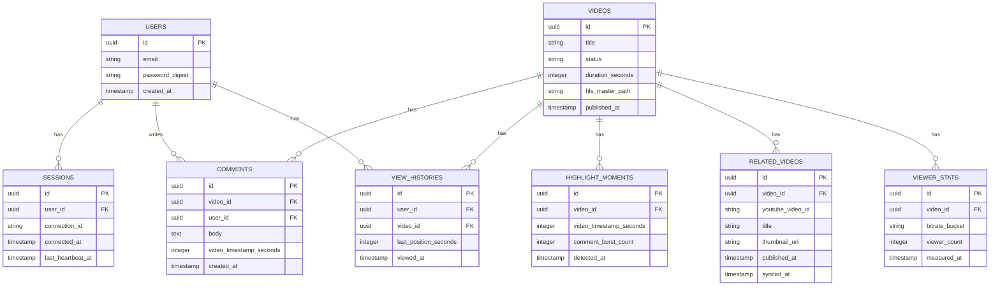

# NijiArchive プロジェクト総合ロードマップ Part 2
## システムアーキテクチャ設計・データモデル・API設計

---

## 1. 全体アーキテクチャ

### 1-1. コンポーネント構成図（テキスト表現）

```
[管理者]
   │ MP4アップロード
   ▼
[Rails 8 アプリケーション（VPS, Kamal管理）]
   │
   ├── Web層（Puma）
   │     ├── 認証・視聴権限（Rails 8 Authentication Generator）
   │     ├── 動画メタデータAPI
   │     ├── コメントAPI
   │     └── 管理画面
   │
   ├── リアルタイム層（Action Cable）
   │     ├── コメントチャンネル
   │     ├── 同時ログイン制限チャンネル
   │     ├── 視聴者数集計チャンネル
   │     └── 配信可視化ダッシュボード用チャンネル
   │
   ├── 非同期処理層（Solid Queue）
   │     ├── FFmpeg HLS変換ジョブ
   │     ├── コメント永続化ジョブ
   │     ├── 盛り上がり検出集計ジョブ
   │     └── YouTube API定期同期ジョブ
   │
   └── データ層（PostgreSQL）
         ├── Solid Queueテーブル
         ├── Solid Cacheテーブル
         ├── pgvector拡張（Step 7以降）
         └── アプリケーションテーブル群

[Cloudflare]
   ├── DNS / WAF / LB
   ├── R2（HLSチャンク・マニフェスト保管）
   ├── CDN（R2の配信キャッシュ）
   └── AI Gateway（Step 7以降）

[外部サービス]
   └── YouTube Data API v3（関連動画メタデータ取得）
```

### 1-2. 二軸コンセプトのアーキテクチャ上の表現

**軸1（ファンポータル）の技術的実体**
- 動画視聴：Rails + R2 + CDN + hls.js
- コメント：Action Cable「コメントチャンネル」
- 関連動画：YouTube API連携バッチ処理 + キャッシュ

**軸2（配信可視化）の技術的実体**
- クライアント側：hls.jsのイベント（レベル切り替え、バッファ状態等）をJavaScriptでフックし、Action Cableの「ダッシュボードチャンネル」に送信
- サーバー側：全クライアントから送られてきたビットレート情報を集計し、Solid Cacheに保持
- 表示側：集計結果をAction Cable経由でブロードキャストし、ダッシュボードUIにリアルタイム反映

**重要な設計判断**：軸2のダッシュボードは「読み取り専用の可視化レイヤー」として設計し、軸1の視聴体験のコアロジックには一切影響を与えない。ダッシュボードがダウンしても動画再生は継続できることを設計上の必須要件とする（責務分離）。

---

## 2. データモデル設計

### 2-1. 主要エンティティ一覧

```
User（利用者）
Video（アーカイブ動画）
Purchase（視聴権限、無料公開の場合は視聴履歴として扱う）
Session（同時ログイン制限のための接続管理）
Comment（コメント）
HighlightMoment（盛り上がり検出結果）
RelatedVideo（YouTube API経由の関連動画）
ViewerStat（視聴統計、ビットレート分布等）
```

### 2-2. ER図（mermaid記法）



### 2-3. テーブル設計の意図（設計判断ポイント）

**Sessions（同時ログイン制限）**
- なぜ独立したテーブルにするか：Phase 4テーマ2で学んだ「整合性が必要なデータ」に該当するため、Solid Cache（結果整合性寄り）ではなくDB（強整合性）で管理する
- `connection_id`：Action Cableのコネクション識別子を保持し、切断検知時に該当レコードを削除する
- `last_heartbeat_at`：ハートビートのタイムスタンプを更新し続け、一定時間更新がなければ「切断されたとみなす」バッチ処理で掃除する

**Comments（コメント）**
- なぜAP設計にするか：コメントは「多少遅れてDBに反映されても実害がない」表示用データ（Phase 4テーマ2の判断軸）
- 実装上は、投稿された瞬間にAction Cableで即座に他ユーザーへブロードキャストし、DBへの永続化はSolid Queueの非同期ジョブに任せる

**HighlightMoments（盛り上がり検出）**
- `comment_burst_count`：一定時間窓（例：30秒）内のコメント数を集計し、閾値を超えたタイミングを記録する
- Solid Queueの定期ジョブ（cron的な実行）で計算し、DBに保存する設計とする

**ViewerStats（視聴統計、軸2の心臓部）**
- `bitrate_bucket`：厳密な数値ではなく「1080p帯」「720p帯」のような区分（バケット）で集計することで、集計コストを抑える
- 短い間隔（例：5秒）でスナップショットを取り、Solid Cacheに直近値をキャッシュしつつ、一定間隔でDBに永続化する

### 2-4. なぜCommentsとViewerStatsをAP寄りに、Sessionsだけ強整合性にするか（設計哲学の一貫性）

Phase 4テーマ2で確立した「表示用かトリガーか」の判断軸をそのまま適用する。

```
Comments：表示用データ → AP寄り（結果整合性でよい）
ViewerStats：表示用データ → AP寄り（結果整合性でよい）
Sessions：トリガー（同時ログイン許可・拒否の判断材料）→ CP寄り（強整合性が必要）
```

この判断軸を一貫させることが、面接で「なぜこの設計にしたか」を説明する際の軸になる。

---

## 3. API設計

### 3-1. RESTful API（管理・視聴系）

```
GET    /api/v1/videos                    # 動画一覧取得
GET    /api/v1/videos/:id                # 動画詳細（Presigned URL含む）
POST   /api/v1/videos                    # 動画アップロード（管理者のみ）
PATCH  /api/v1/videos/:id                # 動画情報更新（管理者のみ）
DELETE /api/v1/videos/:id                # 動画削除（管理者のみ）

GET    /api/v1/videos/:id/comments       # コメント一覧（ページネーション）
POST   /api/v1/videos/:id/comments       # コメント投稿

GET    /api/v1/videos/:id/highlights     # 盛り上がりポイント一覧
GET    /api/v1/videos/:id/related        # 関連動画一覧（YouTube API経由）

POST   /api/v1/sessions                  # ログイン
DELETE /api/v1/sessions                  # ログアウト
```

### 3-2. Action Cableチャンネル設計

```ruby
# コメントチャンネル
CommentsChannel
  - stream_for video
  - receive(data) → コメントをブロードキャスト + 非同期永続化ジョブをエンキュー

# 同時ログイン制限チャンネル
PresenceChannel
  - subscribed → セッションレコードを作成、既存セッションがあれば拒否
  - unsubscribed → セッションレコードを削除
  - ハートビート受信 → last_heartbeat_at更新

# 視聴者数チャンネル
ViewerCountChannel
  - 5秒間隔でSolid Cacheの現在視聴者数をブロードキャスト

# ダッシュボードチャンネル（軸2）
DashboardChannel
  - receive(bitrate_data) → クライアントから送られたビットレート情報を集計
  - 5秒間隔で集計結果（ViewerStats）をブロードキャスト
```

### 3-3. なぜREST APIとAction Cableを使い分けるか

- REST API：CRUD操作、状態を変更しないGET、認証を伴う操作 → リクエスト/レスポンスの明確な対応が必要なもの
- Action Cable：リアルタイム性が価値そのものであるもの（コメント、視聴者数、可視化ダッシュボード）

この使い分け自体が、Section 4（API設計ロードマップ）で扱った「Synchronous vs Asynchronous APIs」の実践例になる。

---

## 4. インフラ構成設計

### 4-1. Cloudflare側の構成

```
DNS：nijiarchive.example.com（仮）
WAF：基本ルール + レートリミット（コメント投稿の連投対策）
CDN：R2のHLSチャンクをキャッシュ配信
     マニフェスト（.m3u8）：短いTTLまたはキャッシュなし
     チャンク（.ts）：長めのTTLでキャッシュHITを狙う
R2：動画資産の保管（video_id/resolution/segment_xxx.tsのディレクトリ構成）
LB：将来的な複数VPS対応を見据えて最初から導入しておく（ChronosHubの知見流用）
```

### 4-2. VPS側の構成（Kamal管理）

```
VPS-A（Web + Action Cable）
  - Puma
  - Action Cable（Solid Cableをアダプタとして使用。DBバックエンドのため複数台構成でも共有DB経由で動作する。配信レイテンシはStep 9で実測）

VPS-B（将来的にワーカー分離する場合）
  - Solid Queue Worker専用（FFmpeg変換の負荷をWebから分離）
```

MVP段階ではVPS 1台構成とし、Step 8（スケール設計ドキュメント）で複数台構成への移行設計を文書化する。

### 4-3. Presigned URL設計

- 有効期限：30分程度を初期値とし、実際の視聴継続時間の実測データを見て調整する
- 発行タイミング：視聴ページを開いた瞬間に発行し、途中で切れた場合はJavaScript側で再取得するリトライ処理を入れる

---

## 5. セキュリティ設計

### 5-1. 認証・認可

- Rails 8 Authentication Generatorを使用（Deviseを使わない理由：内部実装を理解した上で使いたいという学習目的、および軽量な要件に対してDeviseはオーバースペック）
- パスワードはbcryptでハッシュ化

### 5-2. 同時ログイン制限の不正回避対策

- ハートビートの間隔と、タイムアウト判定のバランスを慎重に設計する（Phase 1で学んだセッション問題の応用）
- 意図的にタブを非アクティブにする、複数ブラウザを使う等の回避策への耐性は、MVP段階では過剰対応しない（コストに見合わない）

### 5-3. YouTube API利用における制約

- APIキーはRails Credentialsで管理し、リポジトリにコミットしない
- レート制限を考慮し、関連動画の同期はSolid Queueの定期ジョブでバッチ処理する（リアルタイムにAPIを叩かない）

---

## 6. 可視化ダッシュボードの詳細設計（軸2の核心）

### 6-1. クライアント側で収集する情報

```javascript
// hls.jsのイベントをフックする例（設計イメージ）
hls.on(Hls.Events.LEVEL_SWITCHED, (event, data) => {
  // ABR切り替え発生時の情報をAction Cable経由で送信
  dashboardChannel.send({
    type: 'level_switch',
    bitrate: hls.levels[data.level].bitrate,
    resolution: `${hls.levels[data.level].width}x${hls.levels[data.level].height}`,
    timestamp: Date.now()
  })
})

hls.on(Hls.Events.FRAG_LOADED, (event, data) => {
  // チャンク取得のたびに送信すると負荷が高いため、
  // 一定間隔でサンプリングして送信する設計にする
})
```

### 6-2. なぜサーバー側で集計するか（設計判断）

- 各クライアントが個別に情報を持っているだけでは「全視聴者の分布」にならない
- Action Cableの「ダッシュボードチャンネル」に全クライアントの情報を集約し、Solid Cache上で集計してから配信する
- この集計処理自体がPhase 3で学んだ「結果整合性で十分なデータ」の実例になる（1秒単位の完全な正確性は不要、数秒単位の傾向が分かれば価値がある）

### 6-3. パフォーマンスへの配慮

- 全クライアントが高頻度でイベントを送信するとAction Cable自体が負荷を受けるため、クライアント側でのサンプリング（例：5秒に1回だけ送信）を必須とする
- これは今日学んだ「非同期処理の判断軸」（テーマ3）の応用：可視化のためだけに配信本体のパフォーマンスを犠牲にしないという優先順位付け

---

## 次のPartについて

Part 3では、この設計を踏まえた拡張版の実装ステップ（Step 0〜10+）を詳細化する。要件定義・設計フェーズも明示的なStepとして組み込み、運用設計・記事化戦略・スケジュールまで扱う。
